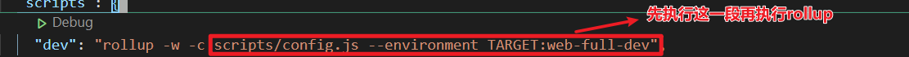
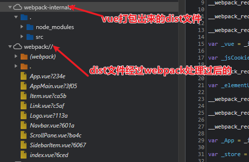

learning

# 调试vue打包源码

## .vscode file

config
```
{
    "configurations": [
        {
            "command": "npm run dev",
            "name": "Run npm dev",
            "request": "launch",
            "type": "node-terminal"
        }
    ]
}
```
## debug rollup config



 

 

## WeakMap && Map
### map

it can support all type to be key value

### WeakMap(防止内存泄漏)

1. Weakmap only support object to be "key",if setting anthor type to be a "key" it will occurr  error.
2、不能包含无引用的对象，否则会被自动清除出集合（垃圾回收机制）。

3、不能枚举,不能遍历,没有size属性，不能clear

例子:
tip:think in heap

const weakmap = new Weakmap()
let keyObject = {1:0}
weakmap.set(keyObject, 4);
let keyObject = null // once `keyObject = null` it means {1:0}(in heap)  nowhere tracks,it will cause memory leak,but follow stmt weakmap can headle,since weakmap will delete it autolly (like rust RC) 

console.log(weakmap.has(keyObject)); //output false

## __dirname

absolute path
## path.join(__dirname,...)

console.log(path.join(__dirname,'a','b'));   假如当前文件的路径是E:/node/1,那么拼接出来就是E:/node/1/a/b。
console.log(path.join(__dirname,'/a','/b','..'));  路径开头的/不会影响拼接，..代表上一级文件，拼接出来的结果是：E:/node/1/a

## path.resolve(__dirname,...)

var path = require("path")                  //引入node的path模块
path.resolve('/foo/bar', './baz')           // returns '/foo/bar/baz'
path.resolve('/foo/bar', 'baz')             // returns '/foo/bar/baz'
path.resolve('/foo/bar', '/baz')            // returns '/baz'
path.resolve('/foo/bar', '../baz')          // returns '/foo/baz'
path.resolve('home','/foo/bar', '../baz')   // returns '/foo/baz'
path.resolve('home','./foo/bar', '../baz')  // returns '/home/foo/baz'
path.resolve('home','foo/bar', '../baz')    // returns '/home/foo/baz'

从后向前，若字符以 / 开头，不会拼接到前面的路径(因为拼接到此已经是一个绝对路径)；
若以 ../ 开头，拼接前面的路径，且不含最后一节路径；
若以 ./ 开头 或者没有符号 则拼接前面路径；
需要注意的是：如果在处理完所有给定的 path 片段之后还未生成绝对路径，则再加上当前工作目录。


#  调试Vue业务源码

## 浏览器上的dist资源

注意下面两个相反，我搞错了



